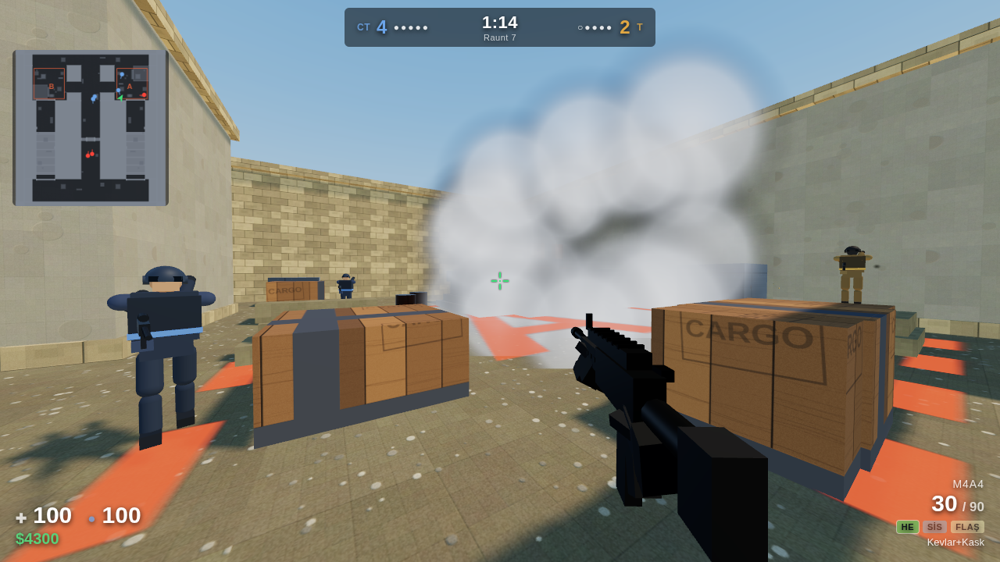
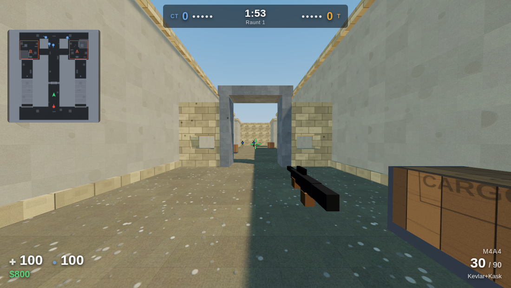

# CS2.js — Three.js ile Counter-Strike tarzı FPS

Tarayıcıda çalışan, derleme adımı olmayan (saf ES modülleri) bir Counter-Strike 2 esintili
nişancı oyunu. Bomba senaryosu, ekonomi, satın alma menüsü, sprey desenli silahlar,
botlar ve MR12 maç formatı içerir.





## Çalıştırma

Dosya sistemi üzerinden (`file://`) ES modülleri çalışmaz; basit bir HTTP sunucusu yeterlidir:

```bash
cd cs2
python3 -m http.server 8000
# tarayıcıda: http://localhost:8000/
```

Node kullanıyorsanız `npx serve .` veya `npx http-server .` de olur.
İnternet bağlantısı gerekmez: three.js `vendor/` altında yereldir.

## Kontroller

| Tuş | İşlev |
| --- | --- |
| `W A S D` | Hareket |
| `Space` | Zıplama (çömelerek zıplama daha yükseğe çıkarır) |
| `Ctrl` / `C` | Çömelme |
| `Shift` | Sessiz yürüyüş |
| `Sol tık` | Ateş |
| `Sağ tık` | Dürbün (AWP / SSG 08) |
| `R` | Şarjör değiştir |
| `1 2 3 4` / tekerlek | Ana silah / tabanca / bıçak / el bombası (`4` tekrar: sıradaki bomba) |
| `E` | Bomba kur (T) veya imha et (CT) |
| `B` | Satın alma menüsü (tur başında, spawn bölgesinde) — `G` HE, `F` flaş, `S` sis, `M` molotof/yangın |
| `Tab` | Skor tablosu |
| `Esc` | Menü / duraklat |

## Oyun mekanikleri

**Hareket** CS'in hareket modelini birim çevrimiyle taklit eder: `sv_accelerate 5.5`,
`sv_friction 5.2`, 800 u/s² yerçekimi, 301 u/s zıplama hızı, havada `airaccelerate`
ile sınırlı ivmelenme (strafe jump çalışır), basamak çıkma (step-up) ve crouch-jump.

**Silahlar** AK-47, M4A4, Galil, FAMAS, MP9, MAC-10, AWP, SSG 08, Deagle, P250,
Glock-18, USP-S, bıçak; el bombaları HE, flaş, sis ve molotof/yangın. Her silahın kendi hasarı, zırh delme oranı,
mesafe zayıflaması, atış hızı ve **sabit sprey deseni** vardır — seri ateşte nişangâhı
aşağı çekerek sprey kontrolü yapabilirsiniz. Hareket / havada olma / çömelme isabeti
değiştirir, nişangâh açıklığı anlık isabetsizliği gösterir.

**Hasar** kafa (×4), göğüs (×1), karın (×1.25), bacak (×0.75) hitbox çarpanları,
kevlar + kask hesabı ve mesafeye bağlı zayıflama ile hesaplanır. Mermiler ince
yüzeyleri (tahta kasa, ince duvar) delip geçebilir (wallbang); delme maliyeti
malzemeye ve kalınlığa bağlıdır.

**El bombaları** HE alan hasarı verir; **flaş** görüş açısına ve mesafeye göre
kör eder (botlar da körelir, ateş edemez); **sis** gerçekten görüşü keser —
bot görüş hattı sis küresinden geçiyorsa hedefi göremez; **molotof/yangın**
saniyede hasar veren bir ateş alanı bırakır, botlar alandan kaçar. En fazla
üç el bombası taşınır, `4` tuşuyla aralarında geçiş yapılır.

**Tur akışı** 6 sn hazırlık, 1:55 tur süresi, 40 sn bomba sayacı, 3.2 sn kurma,
10 sn (kitle 5 sn) imha. Ekonomi: tur ödülleri, yenilgi serisi bonusu, öldürme
ödülleri, kurma/imha primi. MR12: 12. turda taraflar değişir, 13 galibiyet maçı alır.

**Botlar** waypoint grafında A* ile yol bulur, görüş hattı ve ses (silah sesi, ayak
sesi) ile düşman algılar, tepki süresi ve nişan hatası zorluk seviyesine göre değişir,
seri ateş disiplini uygular, takım arkadaşına ateş etmemeye çalışır, siteleri savunur
veya basar, bombayı kurar ve imha eder.

## Görsel

- **PBR malzemeler:** kum taşı blok duvar, sıva, beton, ahşap, metal, çakıllı zemin,
  kum torbası — hepsi canvas ile prosedürel üretilir (albedo + yükseklikten türetilen
  normal ve pürüzlülük haritaları). Doku koordinatları dünya ölçeğinde hesaplandığı
  için kasa ile duvarın doku yoğunluğu aynıdır ve komşu bloklarda kesiksiz devam eder.
- **Aydınlatma:** ACES tone mapping, gradyan gökyüzünden üretilen PMREM ortam
  yansıması, gölge veren güneş + dolgu ışığı.
- **Post-processing:** MSAA hedefi, hafif bloom, tone mapping çıkışı (menüden kapatılabilir).
- **Karakterler:** eklem hiyerarşili prosedürel modeller (kask/kar maskesi, yelek,
  omuz pedleri, sırt çantası, botlar) ve yürüyüş / çömelme / nişan / ölüm animasyonu.
- **Silah modelleri:** her silah parça parça modellenir (gövde, kundak, kavisli şarjör,
  dürbün, sürgü, arpacık); şarjör değiştirirken şarjör düşer, yenisi takılır, kurma kolu
  çekilir. Silah ayrı bir sahnede dar FOV'lu kamerayla çizilir, duvara girmez.
- **Efektler:** iz mermisi, kıvılcım, mermi izleri, kan, boş kovan fırlatma,
  namlu alevi ve ışığı, patlama, sis bulutu, ateş.

## Harita — `de_verge`

İki bombalı (A / B), T spawn'dan üç çıkışlı (long / mid / tünel), mid kapıları
chokepoint'i olan kompakt bir harita. Mimari detay: pencereli mid duvarı, kemerli
koridor girişleri, kirişli/çatılı tüneller, sütunlar, yükseltilmiş platform ve
merdivenler, kasa/varil/kum torbası kapakları.

Tüm geometri eksen hizalı kutulardan oluşur; kutular malzeme başına tek bir birleşik
mesh'e yazılır (tek çizim çağrısı) ve aynı kutular çarpışma ile ışın testlerinde kullanılır.
Yol bulma için ayrı bir engel listesi vardır (pencere boşluklarından bot geçmesin diye).

## Dosya düzeni

```
cs2/
  index.html            HUD iskeleti, importmap
  styles.css            HUD ve menü stilleri
  vendor/               three.js r169 (MIT, yerel kopya)
  src/
    main.js             giriş noktası, menü, ana döngü
    game.js             sahne, aktörler, girdi, olaylar, kare adımı
    config.js           fizik/tur/ekonomi sabitleri
    weapons.js          silah tanımları ve sprey desenleri
    core/math.js        AABB çarpışma ve ışın testleri
    core/input.js       klavye/fare + pointer lock
    core/audio.js       prosedürel WebAudio efektleri
    world/map.js        harita geometrisi, spawnlar, bombasahaları
    world/textures.js   prosedürel PBR doku üretimi
    world/nav.js        waypoint grafı + ızgara doldurma + A*
    entities/actor.js   hareket fiziği, envanter, hitbox
    entities/bot.js     bot yapay zekası
    entities/character.js  üçüncü şahıs karakter modeli ve animasyonu
    entities/viewmodel.js  birinci şahıs silah modelleri ve animasyonu
    systems/combat.js   mermi/bıçak vuruş çözümü, wallbang
    systems/effects.js  tracer, iz, kan, namlu alevi, patlama
    systems/grenades.js el bombası fiziği (HE / flaş / sis / molotof)
    systems/round.js    tur akışı, bomba, ekonomi, skor
    ui/hud.js           HUD, killfeed, satın alma, skor tablosu
    ui/radar.js         mini harita
```

## Bilinen sınırlar

Bu bir Counter-Strike 2 *kopyası değil*, onun oynanışını taklit eden özgün bir
tarayıcı oyunudur. Valve'ın haritaları, modelleri, sesleri ve markası kullanılmamıştır;
tüm içerik prosedürel olarak üretilir.

- Tek harita, tek oyun modu (bomba senaryosu).
- Çok oyunculu ağ desteği yok; rakipler bot.
- Sesler prosedüreldir (harici ses dosyası yoktur).
- Botlar sis/flaş kullanmaz (yalnızca HE atar); yükseltilmiş platformlara çıkmazlar.
- Kaskete/zırha göre model değişmez, kıyafet kişiselleştirmesi yoktur.

## Lisans notu

`vendor/three.module.min.js` three.js r169'dur ve MIT lisanslıdır
(`vendor/three-LICENSE.txt`).
